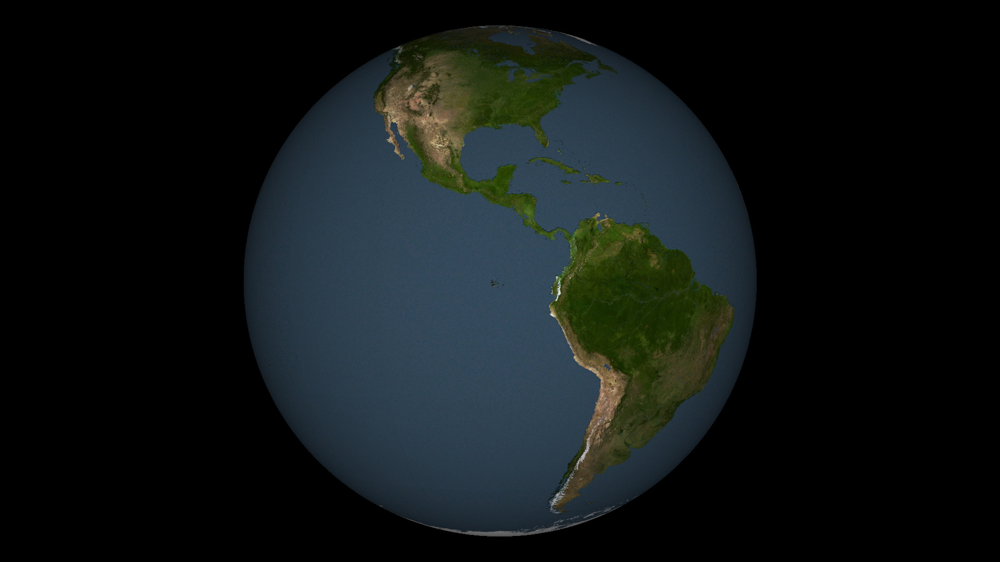

# mscsim-data-terrain

Terrain data set for [MScSim](https://github.com/marek-cel/mscsim).

High resolution photorealistic scenery based on aerial imagery of the Oahu island, medium resolution scenery based on satellite imagery of the Hawaii islands, low resolution scenery based on satellite imagery of the rest of the World.

This data set was generated with [VirtualPlanetBuilder](https://github.com/openscenegraph/VirtualPlanetBuilder).

[Geospatial Data Abstraction Library](https://gdal.org/) (GDAL) was used to process input data.

## Images

## Data Sources

Terrain data is based on the available public domain data.

### Blue Marble Next Generation (BMNG)

The original [Blue Marble](https://en.wikipedia.org/wiki/The_Blue_Marble) is a photo taken by Apollo 17 astronauts on their way to the Moon on December 7th, 1972. In 2005 NASA released a series of satellite imagery of the entire Earth called Blue Marble Next Generation (BMNG).

* [NASA Visible Earth](https://visibleearth.nasa.gov)

### Shuttle Radar Topography Mission (SRTM)

[Shuttle Radar Topography Mission](https://en.wikipedia.org/wiki/Shuttle_Radar_Topography_Mission) was conducted in February 2000 during STS-99 on board of the Space Shuttle Endeavour. Its purpose was to obtain high resolution digital elevation models of most of the Earth surface.

* [USGS EarthExplorer](https://earthexplorer.usgs.gov)

### Landsat Satellite Imagery

[Landsat](https://en.wikipedia.org/wiki/Landsat_program) is a joint USGS ans NASA program to obtain satellite imagery of Earth. Data from Landsat 7 satellite Enhanced Thematic Mapper Plus (ETM+) sensor can be used to obtain Earth true-color imagery. Data covers most of Earth land area.

* [University of Maryland - Global Land Cover Facility](http://glcf.umd.edu/data/landsat/)
* [Technische Hochschule Nürnberg](http://schorsch.efi.fh-nuernberg.de/data/terrain/Landsat/EarthSat/)

### High Resolution Orthoimagery

[USGS High Resolution Orthoimagery](USGS High Resolution Orthoimagery) (HRO) is a collections of aerial photographs with resolution 1 m/pixel or finer, managed and distributed by the USGS EROS Center. Since data came from multiple vendors, resolution, area of coverage, projection, etc. varies.

* [USGS EarthExplorer](https://earthexplorer.usgs.gov)

### MODIS MOD44W Watermask

[Moderate Resolution Imaging Spectroradiometer](https://en.wikipedia.org/wiki/Moderate_Resolution_Imaging_Spectroradiometer) (MODIS) is an imaging sensor on board of the Terra satellite. It was launched by NASA in 1999. MODIS Land Water Mask (MOD44W) is a global raster water mask at 250 m/pixel resolution.

* [University of Maryland - Global Land Cover Facility](http://glcf.umd.edu/data/watermask/)

### State of Hawaii

State of Hawaii provides geospatial data of Hawaii, including satellite true color imagery, LiDAR elevation and coastline data.

* [State of Hawaii - Office of Planning](planning.hawaii.gov/gis/download-gis-data/)
